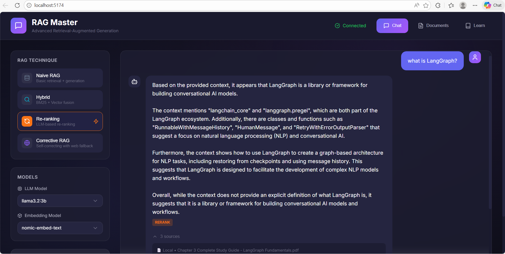

# RAG Master Project

> **Advanced Retrieval-Augmented Generation with Hybrid Retrieval, Re-ranking, and Corrective RAG**

A comprehensive learning project demonstrating 3 advanced RAG techniques Built with FastAPI, LangChain, LangGraph, and React.




---

## 📑 Table of Contents

- [Features](#-features)
- [Quick Start](#-quick-start)
- [Project Structure](#-project-structure)
- [Configuration](#-configuration)
- [API Endpoints](#-api-endpoints)
- [Learning Guides](#-learning-guides)
  - [1. Hybrid Retrieval](#1-hybrid-retrieval-guide)
  - [2. Re-ranking RAG](#2-re-ranking-guide)
  - [3. Corrective RAG (CRAG)](#3-corrective-rag-crag-guide)
  - [4. Pipeline Comparison](#4-pipeline-comparison)
- [References](#-references)

---

## 🎯 Features

### RAG Techniques Implemented

| Technique | Description | Key Components |
|-----------|-------------|----------------|
| **Hybrid Retrieval** | Combines BM25 keyword search with vector semantic search | Reciprocal Rank Fusion (RRF) |
| **Re-ranking** | Post-processes retrieval with LLM or cross-encoder scoring | LLM & Cross-Encoder rerankers |
| **Corrective RAG (CRAG)** | Self-correcting pipeline with relevance evaluation | LangGraph state machine, web search fallback |

### Additional Features
- 🦙 **Ollama Integration** - Local LLM support (qwen3, llama3.2, gemma3)
- 📄 **Multi-format Documents** - PDF, DOCX, TXT, MD support
- 🔄 **Dynamic Model Switching** - Change models at runtime
- 📊 **Technique Comparison** - Compare answers across techniques
- 🎨 **Modern React UI** - Dark theme with glassmorphism

---

## 🚀 Quick Start

### Prerequisites

1. **Ollama** - Install from [ollama.ai](https://ollama.ai)
2. **Python 3.11+** - With conda/pip
3. **Node.js 18+** - For frontend

### Install Ollama Models

```bash
# LLM (choose one - you likely already have these)
ollama pull qwen3:4b
# or: ollama pull llama3.2:3b
# or: ollama pull gemma3:4b

# Embeddings
ollama pull nomic-embed-text
```

### Backend Setup

```bash
cd backend

# Create/activate conda environment
conda activate ASA  # or your environment

# Install dependencies
pip install -r requirements.txt

# Run the server
python main.py
```

Server starts at: http://localhost:8000

API docs: http://localhost:8000/docs

### Frontend Setup

```bash
cd frontend

# Install dependencies
npm install

# Run dev server
npm run dev
```

Frontend starts at: http://localhost:5173

---

## 📁 Project Structure

```
RAG-Master-Project/
├── backend/
│   ├── main.py                 # FastAPI entry point
│   ├── config.py               # Configuration
│   ├── core/                   # Core utilities
│   │   ├── llm.py              # Ollama LLM wrapper
│   │   ├── embeddings.py       # Ollama embeddings
│   │   ├── document_loader.py  # Document processing
│   │   └── vector_store.py     # ChromaDB store
│   ├── rag_modules/            # RAG implementations
│   │   ├── naive_rag.py        # Baseline RAG
│   │   ├── hybrid_retrieval/   # BM25 + Vector
│   │   ├── reranking/          # Re-ranking pipeline
│   │   └── corrective_rag/     # CRAG with LangGraph
│   └── api/                    # FastAPI routes
│
├── frontend/
│   ├── src/
│   │   ├── App.jsx             # Main application
│   │   ├── components/         # React components
│   │   └── services/api.js     # Backend communication
│   └── index.html
│
└── data/
    └── sample_docs/            # Sample documents
```

---

## 🔧 Configuration

Edit `backend/config.py` or create `.env`:

```env
# Ollama
OLLAMA_BASE_URL=http://localhost:11434
OLLAMA_LLM_MODEL=qwen3:4b
OLLAMA_EMBED_MODEL=nomic-embed-text

# RAG Settings
TOP_K_RETRIEVAL=5
HYBRID_ALPHA=0.5
CRAG_RELEVANCE_THRESHOLD=0.7
```

---

## 📚 API Endpoints

| Endpoint | Method | Description |
|----------|--------|-------------|
| `/api/query` | POST | Query with selected RAG technique |
| `/api/compare` | POST | Compare multiple techniques |
| `/api/documents/upload` | POST | Upload document |
| `/api/documents` | GET | List documents |
| `/api/models` | GET | List available models |
| `/api/models/switch` | POST | Switch active models |
| `/api/health` | GET | Health check |

### Example Query

```bash
curl -X POST http://localhost:8000/api/query \
  -H "Content-Type: application/json" \
  -d '{
    "question": "What is attention mechanism?",
    "technique": "hybrid",
    "return_sources": true
  }'
```

---

# 🎓 Learning Guides

---

## 1. Hybrid Retrieval Guide

> **Learn how to combine keyword (BM25) and semantic (vector) search for superior retrieval**

### Overview

Hybrid Retrieval is a technique that combines two retrieval methods:
1. **BM25 (Sparse)**: Traditional keyword matching using term frequency
2. **Vector Search (Dense)**: Semantic similarity using embeddings

By fusing results from both, we get the best of both worlds.

### Why Hybrid Retrieval?

#### The Problem with Pure Vector Search

Vector search is powerful for semantic understanding but struggles with:
- Exact keyword matching (e.g., product codes, names)
- Specialized terminology (e.g., medical/legal terms)
- Out-of-vocabulary words

#### The Problem with Pure BM25

BM25 excels at keyword matching but misses:
- Synonyms and paraphrases
- Conceptual relationships
- Context and meaning

#### The Solution: Combine Both

| Query | BM25 Strength | Vector Strength |
|-------|---------------|-----------------|
| "Python 3.13 features" | Exact version match | Programming context |
| "How to reduce carbon footprint" | Keyword overlap | Semantic meaning |
| "BERT architecture" | Acronym matching | NLP concepts |

### How It Works

#### Step 1: BM25 Retrieval

BM25 scores documents using:
```
score(D, Q) = Σ IDF(qi) · (f(qi, D) · (k1 + 1)) / (f(qi, D) + k1 · (1 - b + b · |D|/avgdl))
```

Where:
- `f(qi, D)` = term frequency in document
- `IDF(qi)` = inverse document frequency
- `k1`, `b` = tuning parameters

#### Step 2: Vector Retrieval

Vector search uses:
```
similarity = cosine(embed(query), embed(document))
```

#### Step 3: Reciprocal Rank Fusion (RRF)

RRF combines rankings:
```
RRF_score(d) = Σ 1 / (k + rank_r(d))
```

Where:
- `k` = constant (typically 60)
- `rank_r(d)` = rank of document in retriever r

### Implementation

#### BM25 Retriever

```python
from rank_bm25 import BM25Okapi

class BM25Retriever:
    def __init__(self):
        self.bm25 = None
        self.documents = []
    
    def index(self, documents):
        corpus = [self.tokenize(doc.page_content) for doc in documents]
        self.bm25 = BM25Okapi(corpus)
        self.documents = documents
    
    def retrieve(self, query, k=5):
        tokens = self.tokenize(query)
        scores = self.bm25.get_scores(tokens)
        top_k = sorted(enumerate(scores), key=lambda x: x[1], reverse=True)[:k]
        return [self.documents[i] for i, _ in top_k]
```

#### Hybrid Fusion

```python
class HybridFusion:
    def fuse_rrf(self, bm25_results, vector_results, k=60):
        scores = {}
        
        for rank, doc in enumerate(bm25_results, 1):
            doc_id = hash(doc.page_content)
            scores[doc_id] = scores.get(doc_id, 0) + 1 / (k + rank)
        
        for rank, doc in enumerate(vector_results, 1):
            doc_id = hash(doc.page_content)
            scores[doc_id] = scores.get(doc_id, 0) + 1 / (k + rank)
        
        # Sort by combined score
        return sorted(scores.items(), key=lambda x: x[1], reverse=True)
```

### Alpha Parameter Configuration

The `alpha` parameter controls the weight:
- `alpha = 0.0`: BM25 only
- `alpha = 0.5`: Equal weight (recommended start)
- `alpha = 1.0`: Vector only

| Use Case | Recommended Alpha |
|----------|-------------------|
| Technical documentation | 0.3-0.4 (more BM25) |
| General knowledge | 0.5-0.6 (balanced) |
| Creative/conceptual | 0.7-0.8 (more vector) |

### Best Practices

1. **Index once, query many**: BM25 indexing is fast but avoid re-indexing
2. **Tune alpha empirically**: Start at 0.5 and adjust based on results
3. **Fetch more candidates**: Retrieve 2-3x more than needed before fusion
4. **Consider query types**: Route different queries to different weights

---

## 2. Re-ranking Guide

> **Learn how to improve retrieval quality by re-scoring and reordering documents**

### Overview

Re-ranking is a two-stage retrieval approach:
1. **Initial Retrieval**: Fast retrieval of candidate documents (using vector or hybrid search)
2. **Re-ranking**: Score each candidate with a more sophisticated model

This trades some latency for significantly better relevance.

### Why Re-ranking?

#### The Problem with Initial Retrieval

Initial retrieval methods optimize for speed:
- Bi-encoders compute query and document embeddings **separately**
- Fast but limited interaction between query and document
- May miss subtle relevance signals

#### The Re-ranking Solution

Re-rankers analyze query-document pairs **jointly**:
- Cross-encoders see both together
- Rich attention between query and document tokens
- Captures nuanced relevance

### Re-ranking Approaches

#### 1. Cross-Encoder Re-ranking

Uses transformer models that encode query and document together:

```python
from sentence_transformers import CrossEncoder

model = CrossEncoder('cross-encoder/ms-marco-MiniLM-L-6-v2')

# Score query-document pairs
pairs = [(query, doc.page_content) for doc in candidates]
scores = model.predict(pairs)

# Reorder by score
ranked = sorted(zip(candidates, scores), key=lambda x: x[1], reverse=True)
```

**Pros:**
- Very accurate relevance scoring
- Captures semantic nuances

**Cons:**
- Slower (can't pre-compute embeddings)
- Requires downloading model

#### 2. LLM-Based Re-ranking

Uses the LLM itself to score relevance:

```python
RERANK_PROMPT = """Score the relevance of this document to the query.
Query: {query}
Document: {document}
Score (1-10):"""

def score_document(query: str, doc: Document) -> float:
    response = llm.invoke(prompt.format(query=query, document=doc.content))
    return float(response.strip())
```

**Pros:**
- Uses existing Ollama models
- No additional downloads
- Can explain reasoning

**Cons:**
- Slower than cross-encoder
- May have parsing issues

### Implementation Details

**LLM Re-ranker** (`llm_reranker.py`):
1. Takes query and candidate documents
2. Prompts LLM to score each 1-10
3. Parses scores and reorders
4. Returns top-k most relevant

**Cross-Encoder Re-ranker** (`cross_encoder.py`):
1. Loads pre-trained cross-encoder model
2. Creates query-document pairs
3. Batch predicts relevance scores
4. Sorts by descending score

### When to Use Re-ranking

| Scenario | Recommendation |
|----------|----------------|
| High-stakes queries | Always use |
| Ambiguous questions | Highly recommended |
| Large candidate pools | Essential |
| Speed-critical apps | Consider batch LLM |
| Limited compute | Skip or use smaller models |

### Best Practices

1. **Retrieve more, then re-rank**: Fetch 2-3x more candidates than needed
2. **Truncate long documents**: Re-rankers have token limits
3. **Cache when possible**: Same query = same scores
4. **Consider hybrid**: Use cross-encoder for top candidates only

---

## 3. Corrective RAG (CRAG) Guide

> **Learn how to build self-correcting RAG pipelines with intelligent fallbacks**

### Overview

Corrective RAG (CRAG) is an advanced pattern that:
1. **Evaluates** retrieved documents for relevance
2. **Corrects** by searching the web when local docs fail
3. **Generates** from the best available context

This handles the fundamental RAG failure: "What if the retrieved documents don't answer the question?"

### The Problem CRAG Solves

#### Standard RAG Failures

1. **Knowledge gaps**: Question about topics not in your documents
2. **Outdated information**: Your docs are stale
3. **Poor retrieval**: Relevant docs exist but weren't retrieved
4. **Partial coverage**: Docs are tangentially related but insufficient

#### CRAG's Solution

Instead of blindly generating from whatever was retrieved:
1. **Evaluate** each document's relevance
2. **Decide** if we have enough information
3. **Supplement** with web search if needed
4. **Generate** from enriched context

### CRAG Architecture

```
┌─────────────┐     ┌─────────────┐     ┌──────────────┐
│  Retrieve   │────▶│  Evaluate   │────▶│   Decide     │
│  Documents  │     │  Relevance  │     │  Next Step   │
└─────────────┘     └─────────────┘     └──────────────┘
                                               │
                    ┌──────────────────────────┼──────────────────────────┐
                    │                          │                          │
                    ▼                          ▼                          ▼
            ┌───────────────┐        ┌───────────────┐        ┌───────────────┐
            │   Relevant    │        │   Ambiguous   │        │ Not Relevant  │
            │   → Generate  │        │   → Enhance   │        │   → Web Search│
            └───────────────┘        └───────────────┘        └───────────────┘
                    │                          │                          │
                    └──────────────────────────┼──────────────────────────┘
                                               ▼
                                      ┌───────────────┐
                                      │   Generate    │
                                      │    Answer     │
                                      └───────────────┘
```

### Implementation with LangGraph

We use LangGraph to implement the state machine:

#### State Definition

```python
class CRAGState(TypedDict):
    question: str
    documents: List[Document]
    relevant_documents: List[Document]
    web_documents: List[Document]
    evaluation_result: Literal["relevant", "not_relevant", "ambiguous"]
    generation: str
    correction_used: bool
```

#### Nodes

1. **Retrieve**: Get documents from vector store
2. **Evaluate**: Score each document's relevance
3. **Web Search**: Query DuckDuckGo for supplementary info
4. **Generate**: Produce final answer

#### Conditional Edges

```python
def decide_correction(state):
    if state["evaluation_result"] == "not_relevant":
        return "web_search"
    elif state["evaluation_result"] == "ambiguous":
        return "web_search"  # Supplement with web
    else:
        return "generate"  # Proceed to generation
```

### Document Evaluation

The evaluator prompts the LLM:

```python
EVALUATION_PROMPT = """
Query: {query}
Document: {document}

Is this document relevant to answering the query?
Output ONLY: RELEVANT or NOT_RELEVANT
"""
```

We use confidence scoring (0.0-1.0) for more nuanced decisions.

### Web Search Integration

When local docs fail, we search the web:

```python
from duckduckgo_search import DDGS

def web_search(query: str) -> List[Document]:
    ddg = DDGS()
    results = ddg.text(query, max_results=3)
    return [
        Document(
            page_content=f"{r['title']}\n{r['body']}",
            metadata={"source": r["href"], "type": "web"}
        )
        for r in results
    ]
```

### When to Use CRAG

| Scenario | CRAG Value |
|----------|------------|
| General knowledge questions | High |
| Current events | Essential |
| Specialized domains with gaps | High |
| Well-covered knowledge base | Lower priority |
| Offline requirements | Cannot use web fallback |

### Configuration

Key parameters:

```python
CRAG_RELEVANCE_THRESHOLD = 0.7  # Minimum score for "relevant"
WEB_SEARCH_MAX_RESULTS = 3      # Number of web results
```

### Best Practices

1. **Tune the threshold**: Too high = too many web searches, too low = poor answers
2. **Indicate sources**: Always tell users when web search was used
3. **Rate limit web search**: Avoid hammering external APIs
4. **Cache web results**: Same query = same results (for a time)
5. **Validate web content**: Web can contain misinformation

---

## 4. Pipeline Comparison

> **When to use which technique?**

### Quick Reference

| Technique | Best For | Latency | Complexity |
|-----------|----------|---------|------------|
| **Naive RAG** | Simple Q&A, prototyping | Fast | Low |
| **Hybrid** | Technical docs, mixed queries | Fast | Medium |
| **Re-ranking** | High-stakes, precision-critical | Medium | Medium |
| **CRAG** | Knowledge gaps, current info | Slow | High |

### Decision Flowchart

```
START
  │
  ▼
┌─────────────────────────────────┐
│ Do you have specialized        │
│ terminology or exact keywords? │
└─────────────────────────────────┘
  │ YES                    │ NO
  ▼                        ▼
┌────────────┐      ┌────────────┐
│  HYBRID    │      │ Is answer  │
│  RETRIEVAL │      │ quality    │
└────────────┘      │ critical?  │
                    └────────────┘
                      │ YES    │ NO
                      ▼        ▼
              ┌────────────┐  ┌────────────┐
              │ RE-RANKING │  │ NAIVE RAG  │
              └────────────┘  └────────────┘
                    │
                    ▼
          ┌─────────────────────┐
          │ Might have knowledge│
          │ gaps or need        │
          │ current info?       │
          └─────────────────────┘
            │ YES          │ NO
            ▼              ▼
      ┌────────────┐    (Keep current)
      │   CRAG     │
      └────────────┘
```

### Technique Details

#### Naive RAG
- **How it works**: Retrieve → Generate
- **Strengths**: Simple, fast, easy to debug
- **Weaknesses**: No fusion, no re-ranking, no correction
- **Use when**: Prototyping, well-curated knowledge base

#### Hybrid Retrieval
- **How it works**: BM25 + Vector → RRF Fusion → Generate
- **Strengths**: Keyword + semantic, handles terminology
- **Weaknesses**: Still no re-ranking
- **Use when**: Technical docs, code, scientific papers

#### Re-ranking RAG
- **How it works**: Retrieve → Re-rank → Generate
- **Strengths**: Much better relevance, handles ambiguity
- **Weaknesses**: Added latency
- **Use when**: Customer support, legal, medical

#### Corrective RAG
- **How it works**: Retrieve → Evaluate → (Web Search) → Generate
- **Strengths**: Self-correcting, handles gaps
- **Weaknesses**: Slowest, requires web access
- **Use when**: General knowledge, real-time info needed

### Combining Techniques

The best pipelines combine multiple:

```
Hybrid Retrieval → Re-ranking → Generation
     ↓
  If poor → CRAG Web Fallback
```

### Performance Benchmarks

Relative comparisons (your mileage may vary):

| Metric | Naive | Hybrid | Re-rank | CRAG |
|--------|-------|--------|---------|------|
| Latency | 1x | 1.1x | 2x | 3-5x |
| Relevance | ★★☆ | ★★★ | ★★★★ | ★★★★ |
| Coverage | ★★☆ | ★★★ | ★★★ | ★★★★★ |
| Complexity | ★☆☆ | ★★☆ | ★★☆ | ★★★★ |

### Exercises

1. **Compare Techniques**: Use `/api/compare` to see how answers differ
2. **Tune Hybrid Alpha**: Try α=0.3 (more BM25) vs α=0.7 (more vector)
3. **Test CRAG Fallback**: Ask about topics not in your documents
4. **Benchmark Latency**: Measure response times for each technique


## 📖 References

- [Generative AI with LangChain, 2nd Edition](https://www.amazon.com/dp/B0DFT24Z9B)
- [LangChain Documentation](https://python.langchain.com/)
- [LangGraph Documentation](https://langchain-ai.github.io/langgraph/)
- [Ollama](https://ollama.ai/)

---

## 📄 License

MIT License - Feel free to use for learning and experimentation!
